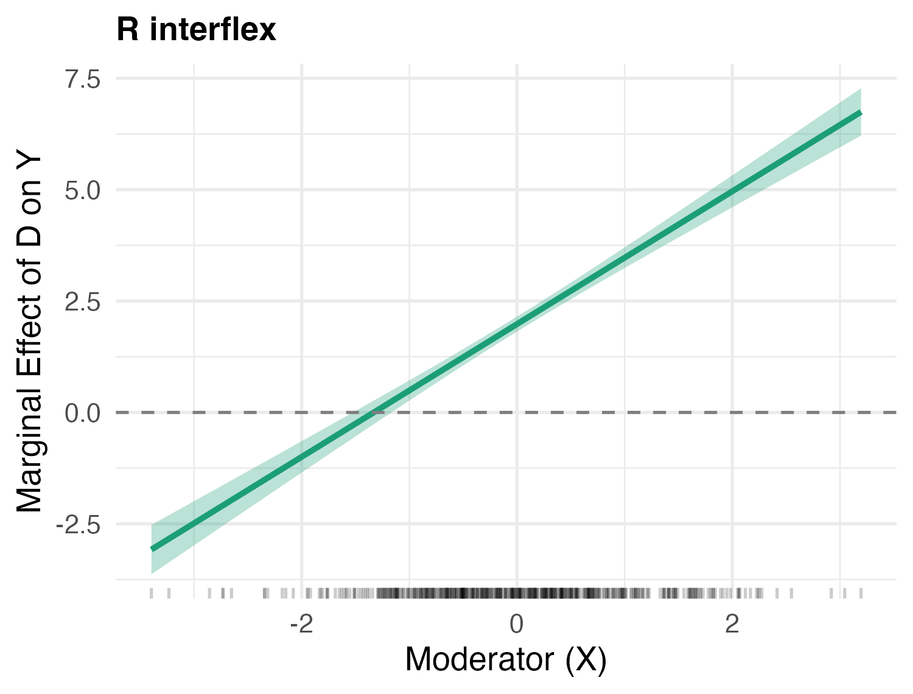
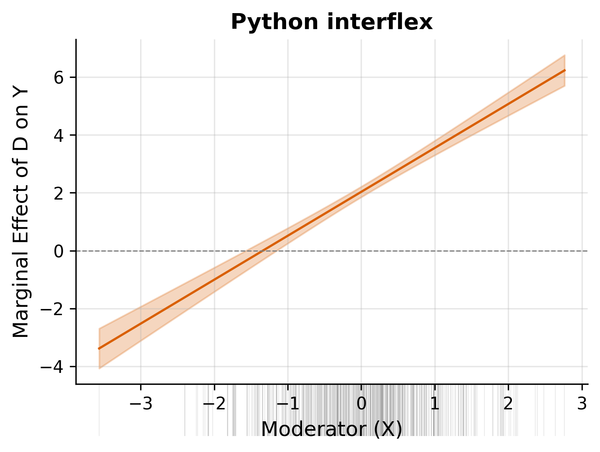

# interflex (Python)

A Python implementation of the linear interaction-effect estimator from the R package [interflex](https://github.com/xuyiqing/interflex). Estimates heterogeneous treatment or marginal effects of a treatment variable across values of a moderating variable, with support for multiple GLM methods, variance estimation paths, and fixed effects.

## Features

- **Five GLM methods**: linear (OLS), logit, probit, Poisson, negative binomial
- **Three variance paths**: delta method (analytical), simulation (MVN draws), nonparametric bootstrap
- **Four vcov types**: homoscedastic, robust (HC1), cluster-robust, panel-corrected (PCSE)
- **Fixed effects**: Frisch-Waugh-Lovell iterative demeaning for one-way and two-way FE
- **Instrumental variables**: 2SLS with optional FE (IV-FWL)
- **Treatment types**: discrete (binary or multi-arm) and continuous
- **Uniform confidence intervals**: bootstrap bisection and delta-method MVN
- **ATE/AME**: average treatment effects (discrete) and average marginal effects (continuous)
- **Plotting**: multi-panel matplotlib figures with CI ribbons and distribution strips

## Installation

```bash
# From source (development mode)
git clone https://github.com/statsclaw/example-R2PY.git
cd example-R2PY
pip install -e ".[dev]"
```

**Note**: The current `pyproject.toml` has a build-backend issue. If `pip install -e .` fails, use:

```bash
export PYTHONPATH="$PWD:$PYTHONPATH"
```

### Dependencies

- Python >= 3.10
- numpy >= 1.24
- scipy >= 1.10
- statsmodels >= 0.14
- pandas >= 2.0
- matplotlib >= 3.7
- seaborn >= 0.12

## R vs Python Comparison

Both the R and Python versions of `interflex` produce equivalent marginal effect estimates. The plots below use the same DGP (`Y = 1 + 2D + 0.5X + 1.5DX + ε`, n=500, same seed):

| R `interflex` | Python `interflex` |
|:---:|:---:|
|  |  |

Both recover the true marginal effect ∂E[Y|D,X]/∂D = 2 + 1.5X with matching point estimates and confidence intervals.

## Quick Start

### Callable Module Pattern

```python
import interflex

# The module itself is callable — no need for interflex.interflex()
result = interflex(data=df, Y="Y", D="D", X="X", estimator="linear")
```

### Discrete Treatment (Binary)

```python
import numpy as np
import pandas as pd
import interflex

# Generate sample data
rng = np.random.default_rng(42)
n = 500
X = rng.uniform(-2, 2, n)
D = rng.choice(["control", "treated"], n)
Z1 = rng.normal(0, 1, n)
D_num = (D == "treated").astype(float)
Y = 1 + 0.5 * X + 2 * D_num + 1.5 * D_num * X + 0.3 * Z1 + rng.normal(0, 0.5, n)
data = pd.DataFrame({"Y": Y, "D": D, "X": X, "Z1": Z1})

# Estimate interaction effects
result = interflex(
    data=data, Y="Y", D="D", X="X", estimator="linear",
    Z=["Z1"],
    method="linear",
    vartype="delta",
    vcov_type="robust",
    figure=True,
)

# Access results
print(result.est_lin)       # Treatment effects at evaluation points
print(result.avg_estimate)  # Average treatment effect (ATE)
```

### Continuous Treatment

```python
D_cont = rng.normal(0, 1, n)
Y_cont = 1 + 0.5 * X + 0.8 * D_cont + 0.6 * D_cont * X + rng.normal(0, 0.5, n)
data_cont = pd.DataFrame({"Y": Y_cont, "D": D_cont, "X": X})

result = interflex(
    "linear", data_cont, "Y", "D", "X",
    treat_type="continuous",
    method="linear",
    vartype="delta",
    figure=True,
)

print(result.est_lin)       # Marginal effects at evaluation points
print(result.avg_estimate)  # Average marginal effect (AME)
```

## API Reference

### `interflex()`

```python
interflex(
    estimator="linear",     # Estimator type (only "linear" supported)
    data=None,              # pandas DataFrame
    Y="",                   # Outcome column name
    D="",                   # Treatment column name
    X="",                   # Moderator column name
    treat_type=None,        # "discrete" or "continuous" (auto-detected if None)
    base=None,              # Base treatment group for discrete treatment
    Z=None,                 # List of covariate column names
    IV=None,                # List of instrument column names
    FE=None,                # List of fixed effect column names
    full_moderate=False,    # Include Z*X interaction terms
    weights=None,           # Weight column name
    na_rm=False,            # Remove rows with NA values
    method="linear",        # "linear", "logit", "probit", "poisson", "nbinom"
    vartype="delta",        # "delta", "simu", "bootstrap"
    vcov_type="robust",     # "homoscedastic", "robust", "cluster", "pcse"
    cl=None,                # Cluster column name (required for "cluster" and "pcse")
    time=None,              # Time column name (required for "pcse")
    neval=50,               # Number of evaluation points
    nboots=200,             # Number of bootstrap replications
    nsimu=1000,             # Number of simulation draws
    figure=True,            # Generate matplotlib plot
    # ... additional plotting parameters
)
```

**Returns**: `InterflexResult` dataclass.

### `InterflexResult`

Key attributes:

| Attribute | Type | Description |
| --- | --- | --- |
| `est_lin` | `dict[str, ndarray]` | TE/ME table per treatment arm: columns (X, TE, sd, lower, upper, [uniform_lower, uniform_upper]) |
| `pred_lin` | `dict[str, ndarray]` | Predicted values at evaluation points |
| `link_lin` | `dict[str, ndarray]` | Link (linear predictor) values |
| `diff_estimate` | `dict[str, DataFrame]` | Differences of TE/ME across moderator values |
| `vcov_matrix` | `dict[str, ndarray]` | TE/ME covariance matrix per arm |
| `avg_estimate` | `dict[str, DataFrame]` | ATE (discrete) or AME (continuous) |
| `figure` | `Figure or None` | matplotlib figure if `figure=True` |
| `use_fe` | `bool` | Whether fixed effects were used |

Methods:

- `result.predict(type="response")` -- re-plot predictions

## Supported Options

### Methods

| Method | Link Function | Use Case |
| --- | --- | --- |
| `"linear"` | Identity | Continuous outcome |
| `"logit"` | Logistic | Binary outcome |
| `"probit"` | Normal CDF | Binary outcome |
| `"poisson"` | Log | Count outcome |
| `"nbinom"` | Log | Overdispersed count |

### Variance Types

| VarType | Description |
| --- | --- |
| `"delta"` | Analytical delta method (fastest, default) |
| `"simu"` | Simulation from MVN coefficient distribution |
| `"bootstrap"` | Nonparametric bootstrap (block bootstrap for clustered data) |

### Vcov Types

| VcovType | Description | Requirements |
| --- | --- | --- |
| `"homoscedastic"` | Classical OLS variance | -- |
| `"robust"` | HC1 heteroscedasticity-consistent | -- |
| `"cluster"` | Cluster-robust sandwich | `cl` specified |
| `"pcse"` | Panel-corrected (Beck & Katz) | `cl` and `time` specified |

## Development

```bash
# Install dev dependencies
pip install -e ".[dev]"

# Run tests
pytest tests/ -v --tb=short

# Run with coverage
pytest tests/ -v --cov=interflex --cov-report=term-missing
```

## References

- Hainmueller, J., Mummolo, J., & Xu, Y. (2019). How Much Should We Trust Estimates from Multiplicative Interaction Models? Simple Tools to Improve Empirical Practice. *Political Analysis*, 27(2), 163-192.
- Original R package: [github.com/xuyiqing/interflex](https://github.com/xuyiqing/interflex)
